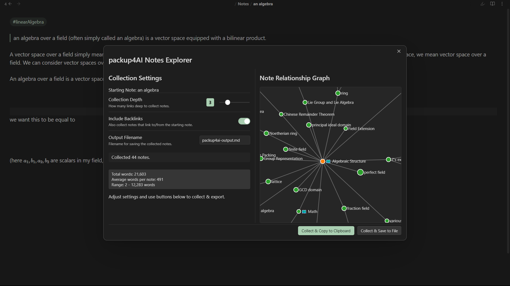

# packUp4AI for Obsidian

**Collect related notes based on links/backlinks to provide focused context for external AI chatbots. Explore note relationships visually and export the bundle.**

Developed by **Jeffry**.

---

## 🤔 What it Does

When interacting with Large Language Models (LLMs) or AI chatbots, providing relevant context is crucial for getting good results. `packUp4AI` helps you gather this context directly from your Obsidian vault.

Starting from your currently open note, it:

1.  **Collects:** Finds notes linked *from* and optionally *to* your starting note, going out to a specified number of "hops" (Collection Depth).
2.  **Visualizes:** Displays an interactive graph showing the relationships between the collected notes. Nodes are sized based on their word count.
3.  **Stats:** Shows you how many notes were collected and provides basic word count statistics (total, average, range).
4.  **Exports:** Allows you to easily copy this context bundle to your clipboard or save it as a new Markdown file in your vault.

This makes it much easier to copy-paste relevant information from your vault into your favorite AI tool.

## ✨ Features

*   **Interactive Relationship Graph:** Uses D3.js (included locally) to visualize how collected notes are connected.
*   **Configurable Collection:**
    *   Set **Collection Depth** (1-10 hops).
    *   Toggle **Include Backlinks**.
    *   Specify **Excluded Files/Folders**.
    *   Set the **Output Filename** for saving.
*   **Real-time Updates:** See the number of collected notes and word count update as you adjust settings.
*   **Word Count Statistics:** Get a quick overview of the collected content size.
*   **Node Sizing:** Graph nodes are sized proportionally to their word count.
*   **Easy Export:**
    *   **Copy to Clipboard:** Get the formatted bundle ready to paste.
    *   **Save to File:** Create a Markdown file containing the context bundle.
*   **Quick Access:** Open via Command Palette.
*   **Settings Tab:** Configure default values for depth, backlinks, output filename, and exclusions.

## 🚀 How to Use

1.  **Open a Note:** Navigate to the note you want to use as the starting point for context collection.
2.  **Activate the Plugin:**
    *   Open the Command Palette (`Ctrl+P` or `Cmd+P`).
    *   Search for and select `packUp4AI: Open packup4AI Notes`.
3.  **Use the Modal:**
    *   The `packUp4AI Notes Explorer` modal will appear.
    *   **Left Pane:** Adjust `Collection Depth`, `Include Backlinks`, and `Output Filename`. You'll see the collection status and word count update here.
    *   **Right Pane:** See the interactive relationship graph of the collected notes. Hover over nodes for titles and word counts. Click nodes to open them in Obsidian.
    *   **Bottom Buttons:**
        *   `Collect & Copy to Clipboard`: Gathers the notes based on current settings and copies the formatted bundle to your clipboard.
        *   `Collect & Save to File`: Gathers the notes and saves the bundle to the specified `Output Filename` in your vault.

